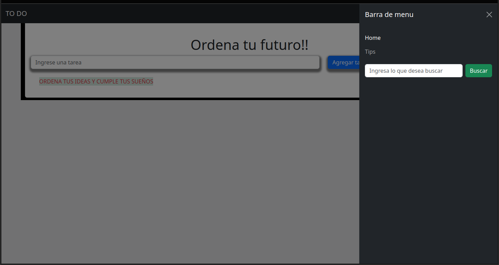

# mi primer TO-DO-DOM
Este proyecto fue creado en js, elemento por elemento (createElement) y se le agrego atributos a traves de (classlist).
fue todo un reto lograr pero con la practica lo logre.
y el diseño fue de bootstrap y css propio.

